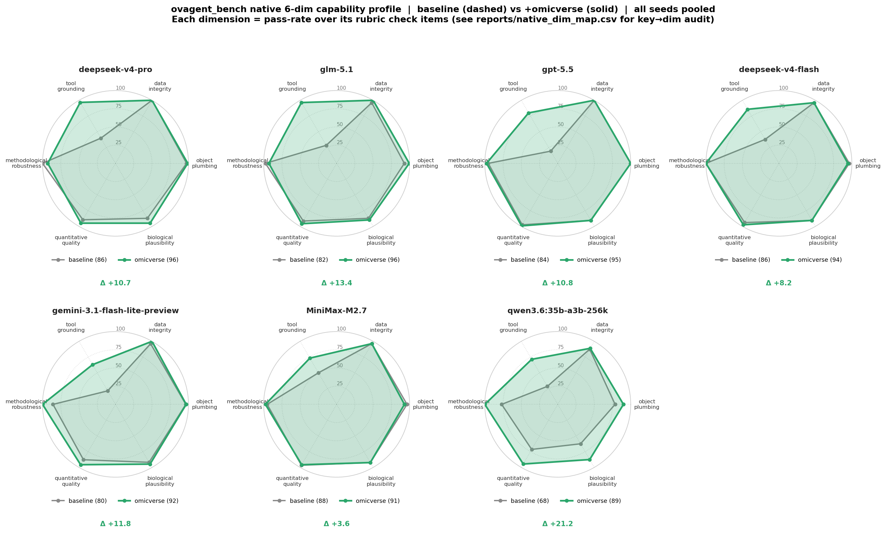
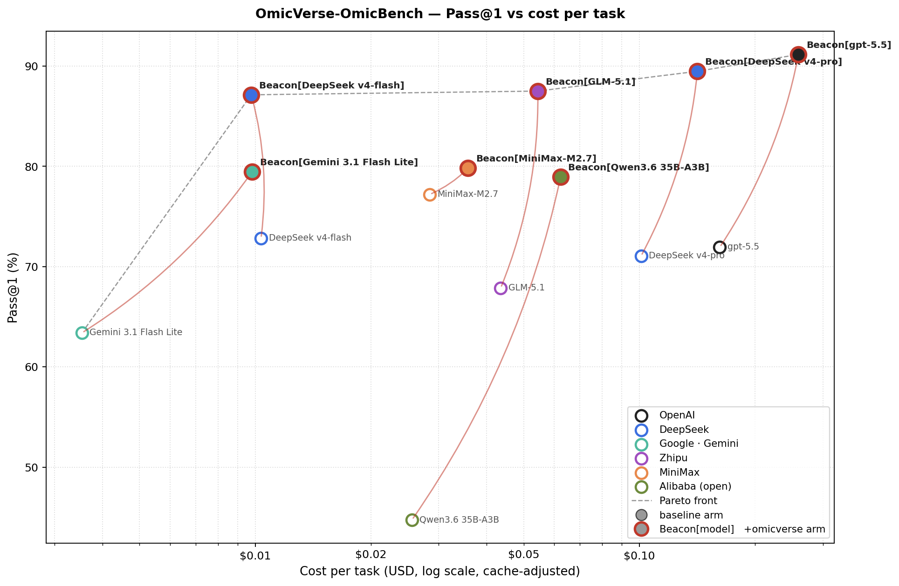

<p align="center">
  
  
  
  
  
</p>

# OmicVerse-OmicBench — agent harness & results

> **Task spec, fixtures, rubrics, judge code, and oracle references live on the
> Hugging Face Hub: [`omicverse/OmicBench`](https://huggingface.co/datasets/omicverse/OmicBench).**
> This repository is the **companion** — the agent harness, system prompts,
> sweep configurations, reproducible per-model results, headline figures,
> and extended capability analysis. It does **not** duplicate the dataset
> content; `scripts/fetch_omicbench.sh` pulls it from HF.

## Evaluation coverage

| | OmicBench (on HF) | This repo, v1.0 |
|---|:---:|:---:|
| Tasks | 44 | **38** |
| Layers | A B C **D** E F G L | A B C E F G L (D excluded) |
| Models tested × arms | — | 7 × 2 (baseline / +Beacon) |
| Seeds | — | 3 per (model, arm) except qwen (1) |

**Layer D (paired multi-omics RNA + ATAC) — D01 and D02 — is not yet in v1.0**: those two tasks were added to OmicBench after the v1.0 sweep, and require an extra environment (`snapATAC2`, `muon`). They will be filled in **v1.1**; see `docs/05_changelog.md` for the planned scope.

The headline numbers below are therefore Pass@1 over the 38-task v1.0 suite, not the full 44-task HF spec. If you re-run with all 44 tasks on your own infrastructure, please ship the extra rows back as a PR — the harness already supports them; only the prior sweeps don't.

## What this measures

OmicBench is an agent benchmark spanning 8 omics modalities (scRNA
preprocessing & workflows, spatial transcriptomics, paired multi-omics,
bulk RNA-seq + metabolomics, RNA velocity / trajectory, microbiome 16S,
and single-cell foundation models). Every task is graded by a
deterministic verifier — no LLM judge in the grading loop — making
re-runs bit-identical given a fixed trajectory.

This repository tests a single hypothesis with a clean ablation:

> *Does giving a generic coding agent **omicverse domain knowledge in its
> system prompt** lower hallucination and raise analytical capability on
> real omics workflows?*

Two arms, same agent loop ([mini-swe-agent](https://github.com/SWE-agent/mini-swe-agent)),
same LLM, same tool surface (one `bash` per turn), same data, same env:

| Arm | What it has |
|---|---|
| `*_omicverse`  (Beacon)  | `prompts/omicverse_system.md` — registry-lookup discipline + coding conventions + skill discovery |
| `*_baseline` | a bare mini-swe-agent system prompt; must rediscover omicverse on its own |

Both arms can `import omicverse as ov`; the baseline arm just isn't told.
This is a **prior-knowledge** ablation, not a tool-availability one.

A third reference arm (`human_scanpy`) — deterministic hand-coded
scanpy / scvelo / numpy scripts — sits in `baselines/` as a ceiling.

## Headline results

**Pass@1 across the 38 v1.0 tasks · 7 LLMs · seeds {0,1,2} unless noted**

| LLM                   | Baseline | +Beacon | Δ      |
|-----------------------|---------:|--------:|-------:|
| qwen3.6:35b-a3b · 1 seed | 44.7%  | 78.9%   | **+34.2** |
| GLM-5.1               | 67.1%    | 87.7%   | +20.6  |
| gpt-5.5               | 71.9%    | 91.2%   | +19.3  |
| deepseek-v4-pro       | 71.1%    | 89.5%   | +18.4  |
| gemini-3.1-flash-lite | 62.7%    | 79.0%   | +16.2  |
| deepseek-v4-flash     | 73.7%    | 86.8%   | +13.2  |
| MiniMax-M2.7          | 77.2%    | 79.8%   | +2.6   |
| **simple mean**       | **66.9%**| **84.7%** | **+17.8** |

The pattern is consistent with a long-tail hypothesis: the weakest
baseline receives the largest uplift, while the strongest already-
specialized baseline (MiniMax-M2.7) sees only a marginal gain.

### Where the uplift comes from

`analysis/radar_native.py` partitions the 140 rubric checks into six
capability dimensions and computes per-dimension pass rates. Almost the
entire +17.8 pp uplift is concentrated on **tool grounding** — whether
the agent correctly invokes specialized algorithms (`cnmf`, `wgcna`,
`ccc`, foundation-model inference, …) versus producing a stub or
fabricated output:

| Dimension | Baseline | +Beacon | Δ |
|---|---:|---:|---:|
| **tool_grounding** | **32.3%** | **80.9%** | **+48.6 pp** |
| quantitative_quality | 89.7% | 96.2% | +6.5 pp |
| biological_plausibility | 86.0% | 91.4% | +5.4 pp |
| methodological_robustness | 92.9% | 97.3% | +4.4 pp |
| object_plumbing | 94.0% | 96.1% | +2.1 pp |
| data_integrity | 96.0% | 97.3% | +1.3 pp |

Baseline models know specialized algorithms exist but cannot reliably
assemble the correct call from a bare bash shell. Beacon's typed
function registry and skill index close most of that gap.



*One mini-radar per LLM; gray polygon = baseline arm, green polygon =
+Beacon arm; Δ under each panel is the overall pass-rate uplift. The
single corner consistently extending under +Beacon is `tool_grounding`
— the same pattern across all 7 LLMs, differing only in magnitude. See
`analysis/README.md` for methodology and the full per-dimension table.*

### Cost vs Pass@1

Per-task **cache-adjusted** dollar cost (lower bound: assumes a warm
prompt cache; per-call `prompt_tokens` increments are read out of each
agent trajectory by `analysis/bench_cost.py`):



*Hollow dot = baseline arm, solid dot with red ring = +Beacon arm,
arrow = the omicverse uplift. The Pareto front (dashed gray) is dominated
by **Gemini 3.1 Flash Lite** at the cheap end (~$0.004/task baseline,
~$0.010/task +Beacon) and **Beacon[gpt-5.5]** at the high-quality end
(~$0.26/task at 92% Pass@1). Two open-weights backends sit on the front
mid-range: **Beacon[DeepSeek v4-flash]** at $0.010 / 86% and
**Beacon[GLM-5.1]** at $0.054 / 89% — both deliver headline scores at a
fraction of the gpt-5.5 cost. **Beacon[Qwen3.6 35B-A3B]** lands at
$0.062 / 79% Pass@1 with the largest single uplift on the chart
(+34 pp from a 45% baseline).*

> Qwen3.6:35b-A3B was actually run locally on ollama at zero dollar
> cost; the cost shown here uses OpenRouter list prices ($0.15/$1.00
> per M in/out, no documented cache discount) so it can be compared
> apples-to-apples with the API-backed models on the same axis. The
> chart-only `qwen-3.6:27b` xmodel side-sweep is omitted (only 4 cells).

### Ablating Beacon

The full Beacon prompt has three components: a static domain prompt,
a function-registry lookup tool, and a skill-discovery tool. Two
ablations isolate the contribution of the structured-discovery part:

| Variant (1 seed each) | gpt-5.5 | deepseek-v4-flash |
|---|---:|---:|
| Baseline | 73.7% | 71.1% |
| Beacon — `no_registry` (drop discovery tools) | 63.2% | 84.2% |
| Beacon — `doc_rag` (replace registry with vanilla embedding RAG) | 76.3% | 71.1% |
| Beacon — full | 92.1% | 86.8% |

`doc_rag` is the load-bearing control: vanilla embedding retrieval over
docstrings is **statistically equivalent to baseline** on both LLMs.
Beacon adds ~+15 pp on top, isolating the gain to the structured
registry + skill discovery, not just "more documentation in context".

## Quick start

```bash
# 0. environment — edit the template with your API keys, then source:
cp bench-env.template.sh bench-env.sh
$EDITOR bench-env.sh                       # fill DEEPSEEK_API_KEY etc.
source bench-env.sh

# 1. fetch task fixtures + rubrics from HF (~10.7 GB):
bash scripts/fetch_omicbench.sh

# 2. (optional, for doc_rag ablation only) build the embedding index:
python scripts/build_doc_rag_index.py

# 3. run a sweep — produces trajectories/<run>/<task>__<arm>__<model>__seed<n>.json
bash scripts/run.sh   configs/deepseek_v4_pro_full.yaml

# 4. grade — produces results/<run>/grades.csv + summary.md
bash scripts/grade.sh deepseek_v4_pro_full

# 5. cross-run analysis + figures
bash scripts/analyze.sh
```

Reproducing the headline numbers without re-running the sweep:
`results/<run>/grades.csv` is committed for every canonical run; pass it
through `bench.report` or eyeball `summary.md` to verify each row.

## Repo layout

```
OmicVerse-OmicBench/
├── README.md                       this file
├── LICENSE                         PolyForm Noncommercial 1.0.0
├── pyproject.toml                  package metadata
├── Makefile                        make sweep / grade / analyze targets
├── bench-env.template.sh           env template — fill in & source
├── .gitignore
│
├── bench/                          harness Python package
│   ├── runner.py                       sweep dispatcher
│   ├── grader.py                       per-task pass/fail rules (mirrored from HF)
│   ├── grade_run.py                    grades.csv writer
│   ├── report.py / figures.py          aggregate + paper figures
│   ├── stats.py                        bootstrap CIs, McNemar
│   ├── failure_taxonomy.py             per-trajectory failure-mode tagger
│   ├── tasks.py / config.py / …
│   └── adapters/
│       ├── mini_swe.py                 mini-swe-agent + LiteLLM (6 LLMs)
│       ├── gpt_oauth_model.py        ChatGPT OAuth bridge for gpt-5.5
│       ├── human_scanpy.py             deterministic scanpy ceiling
│       └── persistent_env.py           cross-step IPython kernel
│
├── prompts/                        three system-prompt variants
│   ├── omicverse_system.md             FULL Beacon (registry + skill discovery)
│   ├── omicverse_system_no_registry.md Beacon minus discovery
│   └── omicverse_system_doc_rag.md     Beacon with vanilla embedding RAG
│
├── omicverse_components/           Beacon-side library hooks
│   ├── _ovagent_lookup.py              public wrappers (registry_lookup, skill_lookup)
│   └── ovagent/
│       ├── registry_scanner.py         AST-walks the omicverse source tree
│       ├── bootstrap.py                skill-registry init
│       ├── prompt_builder.py           compact registry summary
│       └── tool_runtime_{exec,workspace}.py
│
├── configs/                        sweep YAMLs (one per arm × ablation)
│   ├── gpt_full.yaml                 gpt-5.5 full sweep
│   ├── deepseek_v4_pro_full.yaml
│   ├── deepseek_full.yaml              v4-flash, full
│   ├── gemini_full.yaml / glm_full.yaml / minimax_full.yaml
│   ├── full_v1.yaml                    qwen3.6:35b-a3b local ollama
│   ├── multiseed_full_v1.yaml          qwen × seeds {0,1,2}
│   └── ablation_{gpt,v4flash}_{no_registry,doc_rag}.yaml
│
├── scripts/
│   ├── fetch_omicbench.sh              wraps `hf download omicverse/OmicBench`
│   ├── run.sh                          launch a sweep from a YAML
│   ├── grade.sh                        grade trajectories → grades.csv
│   ├── analyze.sh                      end-to-end stats pipeline
│   ├── build_doc_rag_index.py          MiniLM-L6-v2 index over 613 callables
│   ├── doc_lookup.py                   doc-RAG retrieval (doc_rag prompt)
│   ├── build_task_md.py                generate task spec sheet
│   └── per_check_{report,detail}.py    failure-mode drill-downs
│
├── results/                        grades.csv + summary.md per canonical run
│   ├── gpt_full_canonical/           gpt-5.5, 3 seeds
│   ├── deepseek_v4_pro_full/           deepseek-v4-pro, 3 seeds
│   ├── deepseek_v4flash_canonical/     deepseek-v4-flash, 3 seeds (post-prompt-cleanup)
│   ├── gemini_full/  glm_full/  minimax_full/   each 3 seeds
│   ├── qwen_local_full/                qwen3.6:35b-a3b, 1 seed
│   └── ablation_{gpt,v4flash}_{no_registry,doc_rag}/   1 seed each
│
├── analysis/                       extended 6-dim capability radar
│   ├── README.md                       methodology + key findings
│   ├── radar_native.py                 native rubric-based radar (recommended)
│   ├── radar_grade.py                  LLM-judge variant (legacy)
│   ├── native_dim_map.csv              key→dim mapping audit
│   ├── radar_grades.jsonl              cached LLM-judge scores
│   ├── ovagent_radar_native.png        headline radar
│   └── ovagent_radar.png               LLM-judge radar
│
├── baselines/                      hand-coded scanpy reference scripts (ceiling)
│   └── A01-G02.py                      one per layer-A/B/G ceiling task
│
├── notebooks/
│   └── 04_results_publication.ipynb    reproduces headline tables & figures
│
└── docs/
    └── 05_changelog.md                  version history + known gaps
```

Publication-quality figures are regenerated on demand from `results/*/grades.csv`
via `bash scripts/analyze.sh` (`bench/figures.py`); they're not checked in to
avoid drift between stored PNGs and the underlying data.

## What's NOT in this repo

| Artifact | Where |
|---|---|
| Task instructions, fixtures, rubric.json, judge.py, oracle/ | HF [`omicverse/OmicBench`](https://huggingface.co/datasets/omicverse/OmicBench) |
| Trajectory JSONs (~30 GB across all runs) | Regenerate by re-running `scripts/run.sh`. The deterministic grader will reproduce every published row in `results/<run>/grades.csv`. If you would like the original trajectories for qualitative inspection, they may be released in a future companion HF dataset (e.g. `omicverse/OmicBench-trajectories`); GitHub release assets cap at 2 GB and aren't a good fit. |

The grader being deterministic is the crucial reproducibility property:
given a fixed trajectory, `bench/grader.py` always produces the same
pass/fail. So `results/<run>/grades.csv` is the load-bearing audit trail;
trajectories are derivable from rerunning, not load-bearing.

## License

This repository (`bench/`, `scripts/`, `prompts/`, `configs/`, `results/`,
`analysis/`, `baselines/`, `notebooks/`, `docs/`, `figures/`) is released
under the [**PolyForm Noncommercial License 1.0.0**](https://polyformproject.org/licenses/noncommercial/1.0.0/).
You may use, modify, and redistribute the code for academic research,
personal study, hobby projects, and any other **noncommercial** purpose.
Commercial use — including any internal use by a for-profit company,
hosted services, or products that generate revenue — requires a
separate license from the copyright holders. Contact the maintainers
to negotiate one.

The code under `omicverse_components/` is mirrored from
[omicverse](https://github.com/Starlitnightly/omicverse) and remains
under its original Apache-2.0 license — that subdirectory is **not**
covered by the PolyForm Noncommercial terms and stays freely commercial-
usable on its own.

The OmicBench task specifications + rubrics on Hugging Face are released
under CC-BY-4.0; the task fixtures are under upstream provider licenses
(see HF dataset card for per-source attribution).
